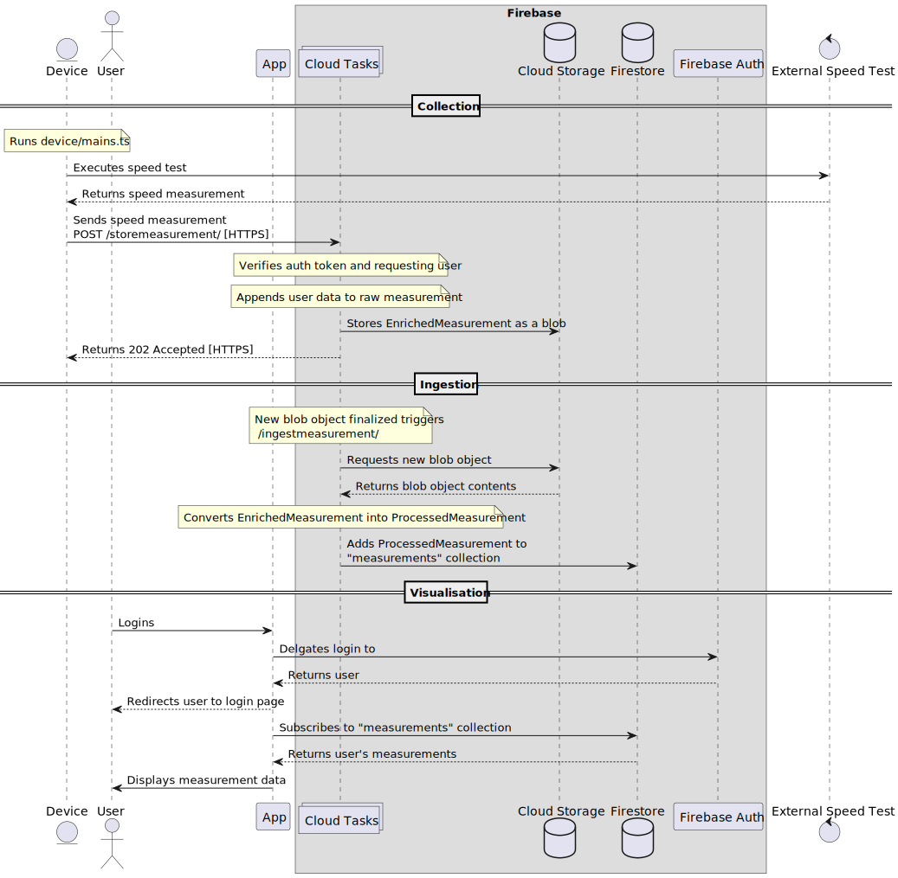

# Internet Speed Monitor

An application for retrieving, storing and visualizing internet speeds. Born
from a frustration with an internet provided, I want to application to monitor
my local internet speeds.

The secondarily purpose of this application was to explore Firebase. This has
led to an over engineered solution to my original problem.

## Sequence

## Development

### Commands
`yarn firebase emulators:start`

## TODOs
- Device script to handle no connection case
  - Store failed attempts locally and then upload with next successful
    connection
